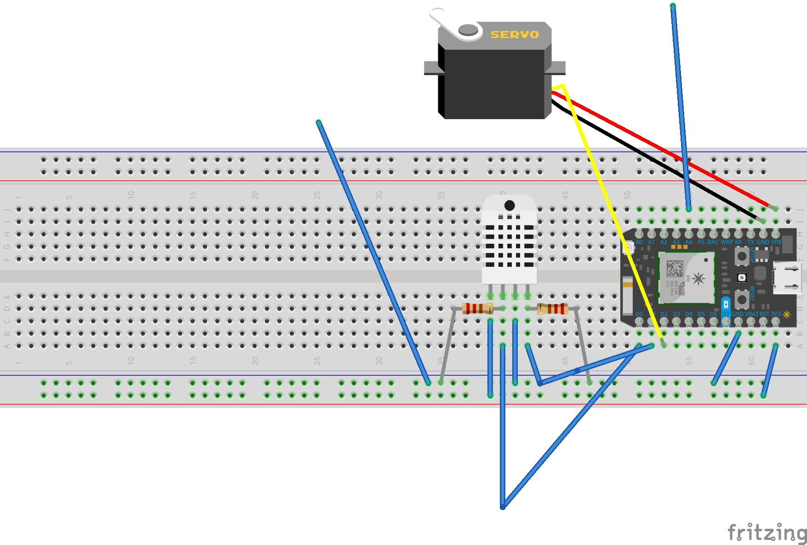

# __Internet of Things Smart Tarp: Developer Edition__

## A. Setup

As you may know from previous projects from CSE 222, there are two main components of this project: hardware (plus the code that runs the hardware)
and UI, or the User Interface.

Like many of the projects you have done, this project involves connecting these
components with the languages below:

1. HTML, CSS, and JavaScript for the UI
2. C++ for programming the hardware

In order to get set up, first gather your materials. You will need:

1. **A Particle Photon:** preferably one that is registered to an accessible Wifi
network

3. **Pressure-Sensitive Conductive Sheets:** also known as Velostat, this material allows us to relay information about voltage in relation to Ohm's Law by applying different amounts of pressure to the material itself.

2. **A Temperature and Humidity Sensor:** you could obtain these separately or buy a sensor that covers both
3. **A Fully Continuous Servo:** a brief studio on motors was done earlier in the semester, note that the servo used then was **not** fully continuous

4. **Conductive Thread:** this thread allows us detect charge

5. **Continuous Rotation Servo Wheels(2):** these will give your project more structure...and they look good!

6. **Resistors and Wires:** you should already have many of each in your Maker Kit; if not, see if you can find any from your 132 kit if you still have it. You'll need approximately ~10-15 wires and a couple of resistors.

7. **Wooden Dowels:** these should be pretty easy to acquire but getting ones that are the right size may be a bit more problematic. They need to fit into  a set of 4 small holes in each of the servo wheels. Additionally, purchase enough such that breaking some will not cause the project to be completed at a much later date (I recommend 4 dowels, each being around 3 feet long). Here are some images for you to reference:

8. **Scissors:** for cutting conductive thread!

9. **Tape:** for making sure things stay together! It does not matter what kind of tape you use, but I preferred blue masking tape and scotch tape because pieces were easy to remove even after being applied.

10. **Screwdriver:** for attaching servo wheels to your servo!

While you should already have a Particle Photon from this past semester, the rest of these items can be purchased online from Adafruit at the links below:

1. [Temp/Humidity Sensor](https://www.adafruit.com/product/3721)
2. [Pressure-Sensitive Conductive Sheets](https://www.adafruit.com/product/1361)
2. [Fully Continuous Servo](https://www.adafruit.com/product/154)
3. [Conductive Thread](https://www.adafruit.com/product/640)
4. [Continuous Servo Wheels](https://www.adafruit.com/product/167)

Now for the actual setup! Let's start with wiring our Particle Photon in the correct manner. Note that the second and third diagrams essentially make up two parts of the first one:

* Wiring Diagram for this Entire Project

* Wiring Diagram for the Temperate & Humidity Sensor

* Wiring Diagram for the Servo/Tarp

Some notes regarding the wiring job for this project:
1. The diagram for the temperature and humidity sensor actually just uses a sensor that is not the exact product I used when putting together this project. For this reason, follow [this link](https://learn.adafruit.com/adafruit-am2320-temperature-humidity-i2c-sensor/arduino-usage) to visualize the diagram with the right sensor (the wiring job is exactly the same as it would be on Arduino).
  * Instead of having SDA and SCL pins like an Arduino device for data input and output, we simply use the D0 and D1 pins respectively to achieve the same effect. Here is [an article](https://community.particle.io/t/i2c-information/4667) that outlines why these pins are substitutes.
2. The wires that look like floating inputs (remember those from earlier in the semester!) in the wiring diagram for the servo actually connect to the condutive thread we discussed above. This thread is then taped onto the pressure-sensitive Velostat material in order to form a circuit. For reference, the image below may be helpful. More on this later!

* Note that one wire is attached to thread coming from the underside of the tarp while the other is visibly coming from the conductive thread that spans the top of the tarp.

## B. Building This Project

After successfully gathering your materials and wiring up your circuit, you should proceed to building our larger hardware components, which include:

1. Putting together the tarp and servo-based spool
2. Applying conductive thread to the pressure-sensitive conductive sheets

### The Tarp

As you saw in the image above, the conductive thread travels throughout the sheet until it leaves the sheet on one side (it leaves on the right in the image). I followed [this semi-applicable tutorial](https://learn.adafruit.com/firewalker-led-sneakers?view=all) when performing this step. If you don't want to watch the provided video and/or read the tutorial, here are summarized thoughts about what I needed to get from this tutorial:

* The velostat pressure sensor, created by taping conductive thread to BOTH sides of the sheet, should be connected to GND and an analog pin of your choice (I used A4). Applying the thread to both sides allows us to have two separate threads (and subsequently two ends), one of which goes to GND while the other will be our analog pin.

* The reason why we applying conductive thread to BOTH sides is because we are trying to form a circuit. The loops described in the tutorial (for making pressure-sensitive shoes) are much shorter than the ones I used and the pieces of thread you will cut for this project.

* When applying the conductive thread to the Velostat, make sure you use plenty of thread to cover most of each side. This will allow for you to have more "pressure points" when testing your project.

So formally, perform the following steps to prep your tarp:

1. Tape two pieces of Velostat together so that you end up with an 11' x 22' sheet. Note that each sheet comes with dimensions 11' x 11'.

2. Wiring conductive thread on both sides, taping at certain checkpoints as you deem fit in an attempt to cover most of the tarp. Make sure both loops of conductive thread "exit" the tarp on the same side (either left or right). See image below.

3. With the two ends of conductive thread that should protrude from the sheet itself,

### The Servo-Based Spool

1. Cut your four dowels into pieces that are longer than 12 inches (the width and length of Velostat sheets + width of wheels) but shorter than 16 inches.

2. Attach one servo wheel to the continuous servo. Then take your dowels, and pull them through the SECOND servo wheel first, before you connect the two wheels through corresponding holes on each wheel.

  * Do this...

  * Before this...

3. You should now have a spool that looks like a rolling pin (wheels at either end, one of which is screwed into the servo + dowels in between connecting the two). Make sure you are all set up to this step!

### Combining the Tarp and the Spool

1. Now that you have your two components at the ready, grab your tape and be gentle as you handle both parts.

2. Securely tape the Velostat sheet to some combination of two dowels with tape. This step was quite clunky for me and I am sure there is a better way to do this, provided some better materials and the right facilities (i.e. an easily accessible woodshop).

3. You should now be able to wrap the Velostat sheet around the dowels, albeit not as tightly as we want it. Know that I was never able to figure out how to best store the Velostat without having to tape it shut when I wasn't using it.

## C. Running This Project

1. Plug in your Particle Photon and make sure you have my sample code in the Particle Dev IDE.

2. If you do not have the right filesystem setup within your folder or repo, refer to this project's general README for instructions.

3. Flash the code to a registered Photon device. Then open up the application's UI, which is located in [TarpApp.html](../../ui/TarpApp.html)

4. 
